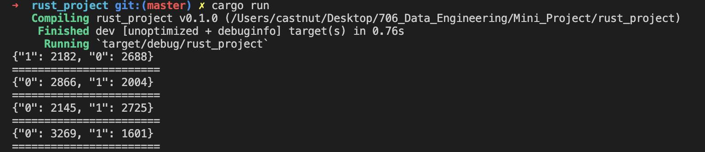
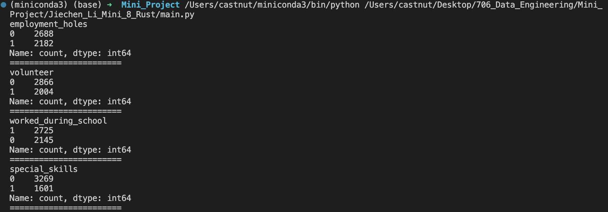
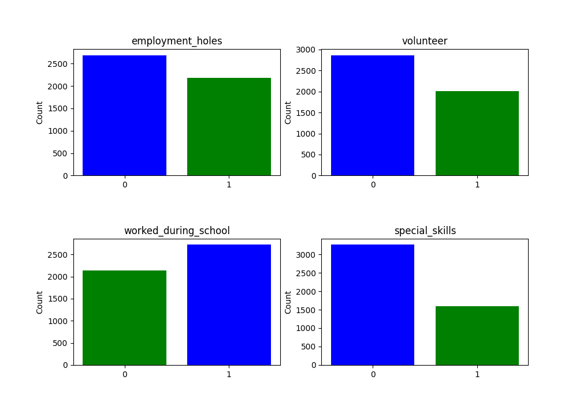

[](https://github.com/nogibjj/python-ruff-template/actions/workflows/cicd.yml)

## 706-Data-Engineering-Template

### Repo Information

This  template is from [706_Data_Engineering_ Mini_Project](https://github.com/carrieli15/706-Data-Engineering-Template.git). I use **highlighted** words to indicate the changes by adding Rust configuration:

- ``.devcontainer`` includes a Dockerfile and devcontainer.json.
                The ``Dockerfile`` within this folder specifies how the container should be built, and other settings in this directory may control development environment configurations. **Add Rust to path**.
                For the ``devcontainer.json``, **to add Rust-specific settings, including the Rust extension for VS Code**.

- ``workflows`` includes GitHub Actions, which contain configuration files for setting up automated build, test, and deployment pipelines for your project. **Adjust the steps to accommodate commands for Rust**.

- ``.gitignore`` is used to specify which files or directories should be excluded from version control when using Git. **Add ``target/``, which is the directory containing Rust build artifacts, and ``Cargo.lock`` ensures consistent dependency versions**.

- ``Makefile`` is a configuration file used in Unix-based systems for automating tasks and building software. It contains instructions and dependencies for compiling code, running tests, and other development tasks. **Add ``target/``Add commands for Rust build, test, format, lint, and run**.

- ``README.md`` is the instruction file for the readers.

- ``main.py`` is a Python file.

- ``requirements.txt`` is to specify the dependencies (libraries and packages) required to run the project. **Add libraries for Python and Rust**.

- ``test_main.py`` is a test file for main.py that can successfully run in IDEs.

### Build Rust Environment in Python Environment

**To set up Rust and Cargo**:

1. *Install Rust using rustup*:
Rust provides a tool called rustup to manage Rust versions and associated tools for the platform.

```
curl --proto '=https' --tlsv1.2 -sSf https://sh.rustup.rs | sh
```

This command will download a script and start the installation. We can accept the default installation options by pressing "1".

2. *Source the shell profile*:
Once the installation is complete, we'll be prompted to run a command to update our shell profile:

```
source $HOME/.cargo/env
```

Alternatively, we can open a new terminal window, and it should recognize the cargo command.

3. *Verify installation*:
Check if both Rust and Cargo are installed:

```
rustc --version
cargo --version
```

4. *Navigate to the "rust_project" directory and initialize a new Rust project*:

```
cd rust_project
cargo init
```

Now, we set up with a Rust environment in ``rust_project`` directory.

### Push Rust Project in the Repo to GitHub

1. *Add rust_project/ as Regular Files*:

```
git add rust_project/
git commit -m "Integrated rust_project into the main repository"
```

Now we can add the ``rust_project`` to our repository as regular files.

2. *Push changes*:

After committing your changes, you can push them to your remote repository.

```
git push -u origin main
```

### GitHub Actions Modify

1. *Replace the command*:
Replace ``make install`` with ``make python_install``, and the same thing for lint, test and format.

2. *Save the file*.

3. *Commit the changes*:

```
git add .github/workflows/cicd.yml
git commit -m "Updated GitHub Actions workflow to use make python_install"
```

### Results

**Rust Result**:<br/>
  

**Python Result**: <br/>
  

**Visualization**: <br/>
  

### Reference

[Online Converting Tool for Python and Rust](https://thepythoncode.com/assistant/code-converter/rust/)
